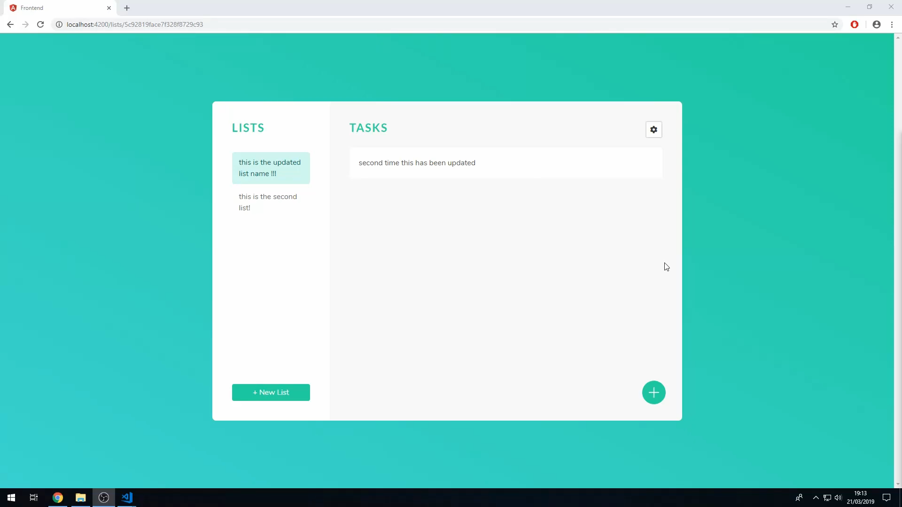

# Task Manager App  

  

This repository contains the **Task Manager Application**, built using the **MEAN Stack** (**M**ongoDB, **E**xpress.js, **A**ngular, **N**ode.js). It enables users to manage tasks effectively with features like task creation, updating, deletion, and secure user authentication.  

---

## 🚀 Features  

- **Task Management**: Add, edit, delete, and view tasks easily.  
- **Authentication**: Secure user registration and login.  
- **Responsive Design**: Fully optimized for mobile, tablet, and desktop use.  

---

## 🛠 Tech Stack  

- **Frontend**: Angular  
- **Backend**: Node.js, Express.js  
- **Database**: MongoDB  

---


## Access the Application
Don't forget to run `npm install` in both the **api** and **frontend** folders to install dependencies
Open your browser and go to http://localhost:4200.


---


## 🤝 Contributing
Contributions are welcome! To contribute: 

1. **Fork the repository.**  
2. **Create a feature branch:**  
   ```bash
   git checkout -b feature-name
3. **Commit your changes:**
   ```bash
   git commit -m "Add new feature"
4. **Push to the branch:**
   ```bash
   git push origin feature-name
5. **Open a pull request.**


---